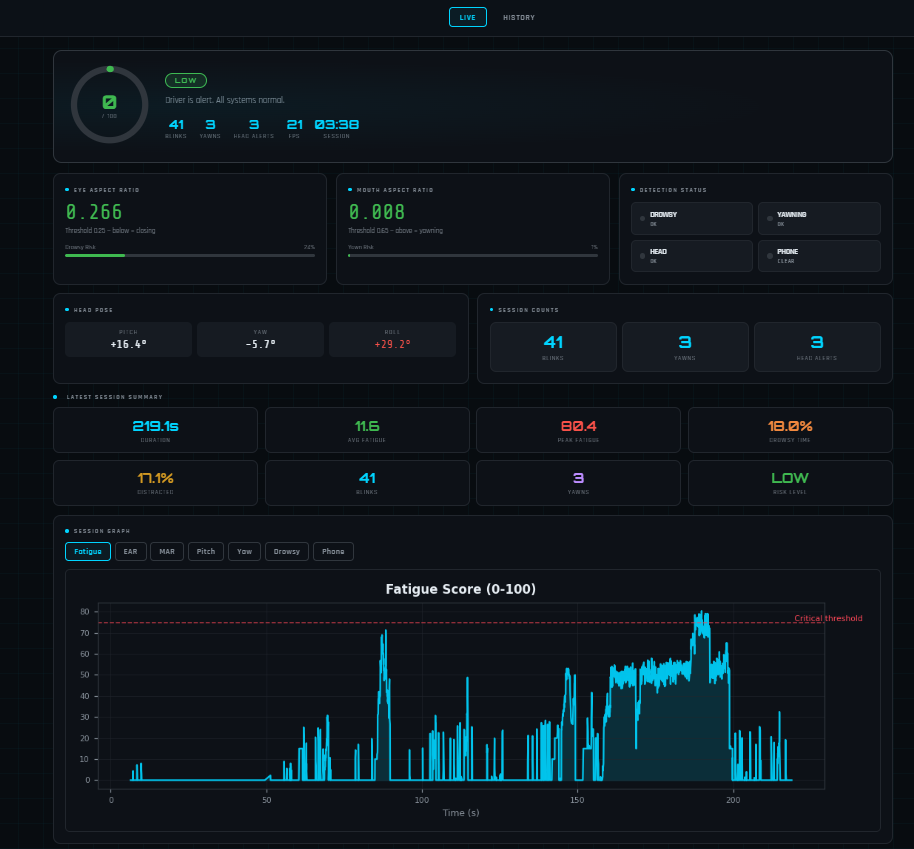

# DriveGuard — Driver Safety System v5

> Real-time AI-powered driver monitoring system that detects drowsiness,
> yawning, head distraction, and phone usage — with emergency alerts,
> live web dashboard, GPS-based rest place suggestions, and session reports.

---

## Features

### Core Detection
| Feature | Method | Alert Trigger |
|---|---|---|
| Drowsiness | Eye Aspect Ratio (EAR) via MediaPipe | Eyes closed ~0.7s |
| Yawning | Mouth Aspect Ratio (MAR) via MediaPipe | Mouth open ~0.6s |
| Head Distraction | solvePnP Euler angles (pitch/yaw/roll) | Head off-road ~1.2s |
| Phone Detection | YOLOv8 (conf >= 70%) | Phone in frame |
| Night/Low-light | Auto brightness detect + adaptive thresholds | DAY/DUSK/NIGHT mode auto-switch |

### Fatigue Score System
- Combined **0–100 fatigue score** from EAR + MAR + Head + Phone
- Risk levels: `LOW` / `MODERATE` / `HIGH` / `CRITICAL`
- Real-time color-coded ring on web dashboard

### Night / Low-Light Mode
System automatically detects ambient brightness every 15 frames and switches between 3 modes:

| Mode | Brightness | EAR Threshold | MAR Threshold |
|---|---|---|---|
| DAY | > 100 | 0.25 | 0.65 |
| DUSK | 60–100 | 0.22 | 0.60 |
| NIGHT | < 60 | 0.20 | 0.55 |

- Thresholds automatically relax in dark — more sensitive detection
- Screen pe **DAY / DUSK / NIGHT** indicator dikhta hai with brightness value
- `NightEnhancer` class — `detectors/night_enhancer.py`
- Note: Consumer webcam mein IR sensor nahi hota — very dark conditions mein hardware upgrade needed (IR camera)

### Critical State Monitor
Two conditions trigger a **"Stop Vehicle Now"** alert:

| Condition | Trigger |
|---|---|
| A — Drowsy + Head Tilt | Both sustained for **20 seconds** |
| B — High Fatigue | Score 75+ for **10 seconds** |

On trigger:
- Urgent voice alert
- Nearest rest places shown on screen (OpenStreetMap, 5km radius)
- Email + Telegram sent to emergency contact with location + rest places

### Emergency Alerts
- **Gmail** — Email with location + rest places + Google Maps link
- **Telegram Bot** — Instant message with same info
- **IP-based Location** — City/region + Google Maps link (~1-5km accurate)
- **Cooldown** — 10 minutes between alerts (configurable)

### Web Dashboard (Flask)
- Live real-time dashboard at `http://127.0.0.1:5000`
- Fatigue score ring, EAR/MAR bars, status indicators, head pose
- Session summary cards + graphs after session ends
- History page with all past sessions + 7 graph types
- Works during session AND after webcam is closed

### Session Reports (CSV)
Two files auto-generated per session in `reports/sessions/`:
- `*_frames.csv` — per-frame EAR, MAR, pitch, yaw, fatigue score
- `*_summary.csv` — total session summary with risk level

### Voice Alerts
- Windows native SAPI TTS (win32com) — no internet needed
- Queue-based system — never blocks the main detection loop

---

## Project Structure

```
driver_safety/
├── main.py                        # Entry point
├── web_only.py                    # Standalone history viewer
├── debug_emergency.py             # Debug emergency alerts
├── config.yaml                    # All thresholds (edit here, not in code)
├── requirements.txt
│
├── detectors/
│   ├── face_detectors.py          # EAR, MAR, HeadPose detector classes
│   ├── phone_detector.py          # YOLOv8 phone detection
│   ├── fatigue_score.py           # 0-100 fatigue score calculator
│   └── night_enhancer.py          # Auto brightness detect + DAY/DUSK/NIGHT adaptive thresholds
│
├── alerts/
│   └── alert_manager.py           # Beep + TTS with cooldown (queue-based)
│
├── safety/
│   └── critical_state_monitor.py  # 2-condition critical state tracker
│                                  # + OpenStreetMap rest place finder
│
├── emergency/
│   └── emergency_alert.py         # Gmail + Telegram alerts with location
│
├── reports/
│   └── session_reporter.py        # CSV frame log + session summary
│
├── ui/
│   └── hud.py                     # All OpenCV drawing logic
│
└── web/
    ├── server.py                  # Flask server + SSE + graph API
    └── templates/
        ├── dashboard.html         # Live dashboard UI
        └── history.html           # Session history + graphs
```

---

## Setup

### 1. Install Dependencies

```bash
pip install -r requirements.txt
```

### 2. Configure Emergency Alerts (Optional)

Edit `config.yaml`:

#### Gmail Setup
1. Go to [myaccount.google.com](https://myaccount.google.com) → Security
2. Enable **2-Step Verification**
3. Go to **App Passwords** → Select Mail + Windows Computer
4. Copy the 16-digit password

```yaml
emergency:
  enabled: true
  gmail:
    enabled: true
    sender_email:   "your.email@gmail.com"
    app_password:   "xxxx xxxx xxxx xxxx"
    receiver_email: "contact@gmail.com"
```

#### Telegram Setup
1. Message [@BotFather](https://t.me/BotFather) → `/newbot`
2. Copy the bot token
3. Message [@userinfobot](https://t.me/userinfobot) → get your chat ID
4. Start your new bot (send `/start` to it)

```yaml
  telegram:
    enabled: true
    bot_token: "1234567890:ABCdef..."
    chat_id:   "123456789"
```

### 3. Run

```bash
python main.py
```

Browser automatically opens at `http://127.0.0.1:5000`

---

## Usage

```bash
# Default — webcam 0 + web dashboard
python main.py

# Different webcam
python main.py --camera 1

# Disable voice alerts
python main.py --no-tts

# Disable web dashboard
python main.py --no-web

# Run on a recorded video (offline evaluation)
python main.py --evaluate my_drive.mp4

# View history without webcam
python web_only.py

# Debug emergency alerts
python debug_emergency.py
```

**Keyboard shortcuts (OpenCV window):**
| Key | Action |
|---|---|
| `ESC` | Quit |
| `R` | Reset all counters |

---

## Configuration Reference

All settings in `config.yaml` — no code changes needed:

```yaml
ear:
  threshold: 0.25        # Lower = more sensitive to eye closure
  drowsy_frames: 20      # Frames eyes must be closed before drowsy alert

mar:
  threshold: 0.65        # Higher = less sensitive to yawning
  yawn_min_frames: 18    # Frames mouth must be open

head_pose:
  yaw_limit: 30          # Max degrees left/right
  pitch_low: -20         # Max degrees looking down
  alert_frames: 35       # Frames off-road before alert (~1.2s @ 30fps)

yolo:
  phone_conf: 0.70       # Min confidence for phone detection (0-1)
  skip_frames: 4         # Run YOLO every 4th frame (performance)

alerts:
  cooldown_seconds: 6.0  # Min gap between same alert
  tts_rate: 150          # Speech speed

emergency:
  critical_fatigue_threshold: 75  # Score above which emergency fires
  cooldown_minutes: 10            # Min gap between emergency alerts
```

---

## How It Works

```
Webcam → OpenCV Frame
           │
           ├── YOLOv8 ──────────────→ Phone Detection
           │
           └── MediaPipe FaceMesh
                    │
                    ├── EAR ─────────→ Drowsiness
                    ├── MAR ─────────→ Yawning
                    └── solvePnP ───→ Head Pose
                              │
                    Fatigue Score (0-100)
                              │
              ┌───────────────┴──────────────┐
              │                              │
        Critical Monitor              Web Dashboard
        (20s Drowsy+Head              (Flask SSE)
         OR 10s Score 75+)
              │
    ┌─────────┴──────────┐
    │                    │
  Voice Alert    Emergency Alert
  (SAPI TTS)    (Gmail + Telegram
                 + Location
                 + Rest Places)
```

---

## Alert Reference

| Alert | Condition | Action |
|---|---|---|
| Drowsy | EAR < 0.25 for ~0.7s | Beep + Voice |
| Yawning | MAR > 0.65 for ~0.6s | Beep + Voice |
| Head Distracted | Pitch/Yaw/Roll exceeded for ~1.2s | Beep + Voice |
| Phone Detected | YOLO conf >= 70% | Beep + Voice |
| Critical Fatigue | Score 75+ for 10s | Strong beep + Voice + Email + Telegram |
| Stop Now (Drowsy+Head) | Both for 20s | Urgent voice + Rest places on screen + Email + Telegram |

---

## Tech Stack

| Library | Purpose |
|---|---|
| OpenCV | Frame capture, drawing, HUD |
| MediaPipe | 478-point face mesh landmarks |
| YOLOv8 (Ultralytics) | Real-time phone object detection |
| SciPy | EAR/MAR Euclidean distance |
| win32com SAPI | Windows native TTS (no internet) |
| Flask | Web dashboard + SSE live stream |
| Matplotlib | Session graph generation |
| PyYAML | Config file management |
| Requests | IP location + Telegram + OSM API |
| smtplib | Gmail SMTP email alerts |

---

## Platform Support

| OS | Status | Notes |
|---|---|---|
| Windows 10/11 | Full support | win32com TTS, winsound beep |
| Linux | Partial | TTS uses pyttsx3 fallback |
| macOS | Partial | TTS uses pyttsx3 fallback |

---

## Session Report Example

`reports/sessions/2026-04-23_14-30-00_summary.csv`:

```
session_date, duration_seconds, blink_count, yawn_count,
drowsy_percent, distracted_percent, avg_fatigue_score,
max_fatigue_score, risk_level
2026-04-23 14:30:00, 1800, 142, 3, 2.1, 5.4, 18.3, 82.1, MODERATE
```

---

## Screenshots

### Driver Monitoring Window




## Demo

- Real-time drowsiness detection
- Phone distraction alerts
- Live fatigue dashboard
- Emergency alert system

[▶ Watch Demo](videos/demo_Recording.mp4)


## Known Limitations

| Limitation | Reason | Production Fix |
|---|---|---|
| Night detection partial | Consumer webcam has no IR sensor | IR/Night-vision camera (e.g. Raspberry Pi NoIR) |
| IP location ~1-5km accuracy | No GPS hardware | USB GPS dongle (~Rs 500) |
| OSM rest places incomplete | India OSM data sparse in cities | Google Places API |
| Single face only | MediaPipe configured for 1 face | Increase max_num_faces |
| Windows-only full support | winsound + win32com | Cross-platform audio library |

> **Interview note:** Night detection uses CLAHE and gamma correction
> for low-light enhancement, but consumer webcams lack IR capability.
> In production, IR cameras (as used in Tesla Autopilot and Mobileye)
> would be used for reliable 24/7 detection.

## License
  
Copyright © 2026 Sneha.

This project is for educational and portfolio purposes only.
Unauthorized copying, modification, or redistribution is not permitted.

## Author

Developed by Sneha kansal using OpenCV, MediaPipe, YOLOv8, Flask, and Python.


<!-- # DriveGuard — Driver Safety System v5

> Real-time AI-powered driver monitoring system that detects drowsiness,
> yawning, head distraction, and phone usage — with emergency alerts,
> live web dashboard, GPS-based rest place suggestions, and session reports.

---

## Features

### Core Detection
| Feature | Method | Alert Trigger |
|---|---|---|
| Drowsiness | Eye Aspect Ratio (EAR) via MediaPipe | Eyes closed ~0.7s |
| Yawning | Mouth Aspect Ratio (MAR) via MediaPipe | Mouth open ~0.6s |
| Head Distraction | solvePnP Euler angles (pitch/yaw/roll) | Head off-road ~1.2s |
| Phone Detection | YOLOv8 (conf >= 70%) | Phone in frame |
  
### Fatigue Score System
- Combined **0–100 fatigue score** from EAR + MAR + Head + Phone
- Risk levels: `LOW` / `MODERATE` / `HIGH` / `CRITICAL`
- Real-time color-coded ring on web dashboard

### Critical State Monitor
Two conditions trigger a **"Stop Vehicle Now"** alert:

| Condition | Trigger |
|---|---|
| A — Drowsy + Head Tilt | Both sustained for **20 seconds** |
| B — High Fatigue | Score 75+ for **10 seconds** |

On trigger:
- Urgent voice alert
- Nearest rest places shown on screen (OpenStreetMap, 5km radius)
- Email + Telegram sent to emergency contact with location + rest places

### Emergency Alerts
- **Gmail** — Email with location + rest places + Google Maps link
- **Telegram Bot** — Instant message with same info
- **IP-based Location** — City/region + Google Maps link (~1-5km accurate)
- **Cooldown** — 10 minutes between alerts (configurable)

### Web Dashboard (Flask)
- Live real-time dashboard at `http://127.0.0.1:5000`
- Fatigue score ring, EAR/MAR bars, status indicators, head pose
- Session summary cards + graphs after session ends
- History page with all past sessions + 7 graph types
- Works during session AND after webcam is closed

### Session Reports (CSV)
Two files auto-generated per session in `reports/sessions/`:
- `*_frames.csv` — per-frame EAR, MAR, pitch, yaw, fatigue score
- `*_summary.csv` — total session summary with risk level

### Voice Alerts
- Windows native SAPI TTS (win32com) — no internet needed
- Queue-based system — never blocks the main detection loop

---

## Project Structure

```
driver_safety/
├── main.py                        # Entry point
├── web_only.py                    # Standalone history viewer
├── debug_emergency.py             # Debug emergency alerts
├── config.yaml                    # All thresholds (edit here, not in code)
├── requirements.txt
│
├── detectors/
│   ├── face_detectors.py          # EAR, MAR, HeadPose detector classes
│   ├── phone_detector.py          # YOLOv8 phone detection
│   └── fatigue_score.py           # 0-100 fatigue score calculator
│
├── alerts/
│   └── alert_manager.py           # Beep + TTS with cooldown (queue-based)
│
├── safety/
│   └── critical_state_monitor.py  # 2-condition critical state tracker
│                                  # + OpenStreetMap rest place finder
│
├── emergency/
│   └── emergency_alert.py         # Gmail + Telegram alerts with location
│
├── reports/
│   └── session_reporter.py        # CSV frame log + session summary
│
├── ui/
│   └── hud.py                     # All OpenCV drawing logic
│
└── web/
    ├── server.py                  # Flask server + SSE + graph API
    └── templates/
        ├── dashboard.html         # Live dashboard UI
        └── history.html           # Session history + graphs
```

---

## Setup

### 1. Install Dependencies

```bash
pip install -r requirements.txt
```

### 2. Configure Emergency Alerts (Optional)

Edit `config.yaml`:

#### Gmail Setup
1. Go to [myaccount.google.com](https://myaccount.google.com) → Security
2. Enable **2-Step Verification**
3. Go to **App Passwords** → Select Mail + Windows Computer
4. Copy the 16-digit password

```yaml
emergency:
  enabled: true
  gmail:
    enabled: true
    sender_email:   "your.email@gmail.com"
    app_password:   "xxxx xxxx xxxx xxxx"
    receiver_email: "contact@gmail.com"
```

#### Telegram Setup
1. Message [@BotFather](https://t.me/BotFather) → `/newbot`
2. Copy the bot token
3. Message [@userinfobot](https://t.me/userinfobot) → get your chat ID
4. Start your new bot (send `/start` to it)

```yaml
  telegram:
    enabled: true
    bot_token: "1234567890:ABCdef..."
    chat_id:   "123456789"
```

### 3. Run

```bash
python main.py
```

Browser automatically opens at `http://127.0.0.1:5000`

---

## Usage

```bash
# Default — webcam 0 + web dashboard
python main.py

# Different webcam
python main.py --camera 1

# Disable voice alerts
python main.py --no-tts

# Disable web dashboard
python main.py --no-web

# Run on a recorded video (offline evaluation)
python main.py --evaluate my_drive.mp4

# View history without webcam
python web_only.py

# Debug emergency alerts
python debug_emergency.py
```

**Keyboard shortcuts (OpenCV window):**
| Key | Action |
|---|---|
| `ESC` | Quit |
| `R` | Reset all counters |

---

## Configuration Reference

All settings in `config.yaml` — no code changes needed:

```yaml
ear:
  threshold: 0.25        # Lower = more sensitive to eye closure
  drowsy_frames: 20      # Frames eyes must be closed before drowsy alert

mar:
  threshold: 0.65        # Higher = less sensitive to yawning
  yawn_min_frames: 18    # Frames mouth must be open

head_pose:
  yaw_limit: 30          # Max degrees left/right
  pitch_low: -20         # Max degrees looking down
  alert_frames: 35       # Frames off-road before alert (~1.2s @ 30fps)

yolo:
  phone_conf: 0.70       # Min confidence for phone detection (0-1)
  skip_frames: 4         # Run YOLO every 4th frame (performance)

alerts:
  cooldown_seconds: 6.0  # Min gap between same alert
  tts_rate: 150          # Speech speed

emergency:
  critical_fatigue_threshold: 75  # Score above which emergency fires
  cooldown_minutes: 10            # Min gap between emergency alerts
```

---

## How It Works

```
Webcam → OpenCV Frame
           │
           ├── YOLOv8 ──────────────→ Phone Detection
           │
           └── MediaPipe FaceMesh
                    │
                    ├── EAR ─────────→ Drowsiness
                    ├── MAR ─────────→ Yawning
                    └── solvePnP ───→ Head Pose
                              │
                    Fatigue Score (0-100)
                              │
              ┌───────────────┴──────────────┐
              │                              │
        Critical Monitor              Web Dashboard
        (20s Drowsy+Head              (Flask SSE)
         OR 10s Score 75+)
              │
    ┌─────────┴──────────┐
    │                    │
  Voice Alert    Emergency Alert
  (SAPI TTS)    (Gmail + Telegram
                 + Location
                 + Rest Places)
```

---

## Alert Reference

| Alert | Condition | Action |
|---|---|---|
| Drowsy | EAR < 0.25 for ~0.7s | Beep + Voice |
| Yawning | MAR > 0.65 for ~0.6s | Beep + Voice |
| Head Distracted | Pitch/Yaw/Roll exceeded for ~1.2s | Beep + Voice |
| Phone Detected | YOLO conf >= 70% | Beep + Voice |
| Critical Fatigue | Score 75+ for 10s | Strong beep + Voice + Email + Telegram |
| Stop Now (Drowsy+Head) | Both for 20s | Urgent voice + Rest places on screen + Email + Telegram |

---

## Tech Stack

| Library | Purpose |
|---|---|
| OpenCV | Frame capture, drawing, HUD |
| MediaPipe | 478-point face mesh landmarks |
| YOLOv8 (Ultralytics) | Real-time phone object detection |
| SciPy | EAR/MAR Euclidean distance |
| win32com SAPI | Windows native TTS (no internet) |
| Flask | Web dashboard + SSE live stream |
| Matplotlib | Session graph generation |
| PyYAML | Config file management |
| Requests | IP location + Telegram + OSM API |
| smtplib | Gmail SMTP email alerts |

---

## Platform Support

| OS | Status | Notes |
|---|---|---|
| Windows 10/11 | Full support | win32com TTS, winsound beep |
| Linux | Partial | TTS uses pyttsx3 fallback |
| macOS | Partial | TTS uses pyttsx3 fallback |

---

## Session Report Example

`reports/sessions/2026-04-23_14-30-00_summary.csv`:

```
session_date, duration_seconds, blink_count, yawn_count,
drowsy_percent, distracted_percent, avg_fatigue_score,
max_fatigue_score, risk_level
2026-04-23 14:30:00, 1800, 142, 3, 2.1, 5.4, 18.3, 82.1, MODERATE
```

---

## License

MIT License — free to use, modify, and distribute.

---

## Author

Built with OpenCV, MediaPipe, YOLOv8, Flask, and Python. -->